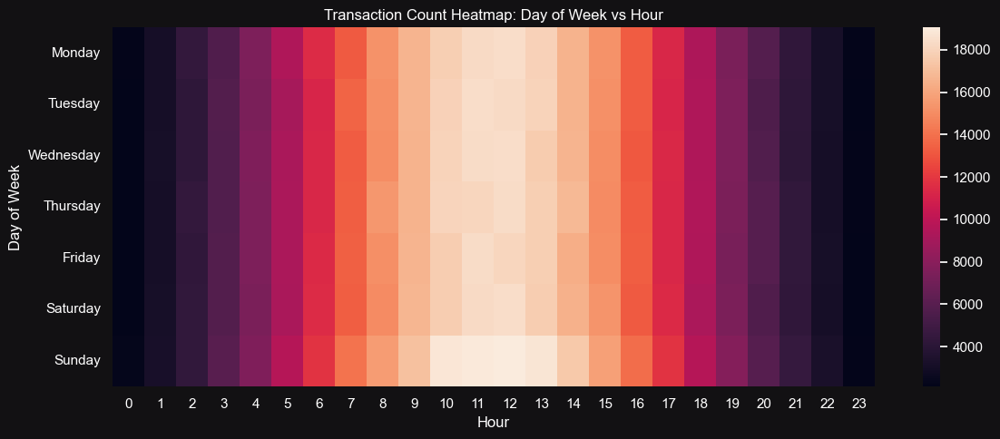

<!-- ============================= -->
<!-- 🏢 Company Header -->
<!-- ============================= -->

  
  Unified Mentor Private Limited

 

<!-- ============================= -->
<!-- 🎯 Project Banner -->
<!-- ============================= -->

  

<!-- ============================= -->
<!-- 🧠 Project Title -->
<!-- ============================= -->
<h1 align='center' style="margin-bottom: 0;">
  
</h1>

<h3 align='center' style="margin-top: 0; font-weight: normal;">
  
</h3>

 

<!-- ============================= -->
<!-- 📋 Table of Contents -->
<!-- ============================= -->
<h2 style="text-align:center;">📑 Table of Contents</h2>
<ul style="font-size:15px; line-height:1.8;">
  <li>About This Project</li>
  <li>Problem Statement</li>
  <li>What the Dataset Contains</li>
  <li>Main Libraries Used</li>
  <li>Visualizations & Charts</li>
  <li>Conclusion</li>
  <li>Acknowledgments</li>
</ul>
 

<!-- ============================= -->
<!-- 📘 About This Project -->
<!-- ============================= -->
<h2>📘 About This Project</h2>

The goal of this project is to <b>develop a system that can classify transactions as fraudulent or legitimate</b>.  
The dataset used is a simulated collection of transaction data designed to mimic real-world scenarios of online financial fraud.

The simulated frauds are based on the following conditions:

<ol style="font-size:15px; line-height:1.7;">
  <li><b>High Transaction Amounts:</b> Any transaction where <code>TX_AMOUNT &gt; 220</code> is marked as fraud.  
  This pattern helps validate basic fraud detection behavior.</li> 
  <li><b>Compromised Terminals:</b> Two terminals are randomly selected daily, and all transactions processed through them for the next 28 days are labeled as fraud — simulating terminal-based fraud scenarios.</li> 
  <li><b>Compromised Customers:</b> Three customers are randomly chosen each day; one-third of their transactions are multiplied by 5 in value and marked as fraudulent — simulating stolen-card or “card-not-present” fraud.</li>
</ol>

This project was developed as part of the <b>Machine Learning Internship</b> at <b>Unified Mentor Private Limited</b>.

 

<!-- ============================= -->
<!-- ❓ Problem Statement -->
<!-- ============================= -->
<h2>❓ Problem Statement</h2>

Financial fraud is one of the fastest-growing threats in today’s digital economy. Every second, hundreds of online transactions occur — but how can we determine which are genuine and which are fraudulent?

<ul style="font-size:15px; line-height:1.8;">
  <li>🤔 Can machines learn to identify fraudulent transactions within milliseconds?</li>
  <li>💳 Which data patterns can expose hidden fraud activities?</li>
  <li>📊 How do features like transaction amount, terminal ID, or spending behavior distinguish legitimate from fraudulent activity?</li>
  <li>🚨 Can models detect frauds that even humans might overlook?</li>
  <li>🧠 Can a system evolve over time as fraudsters change their tactics?</li>
</ul>

 

<!-- ============================= -->
<!-- 🧾 Dataset Description -->
<!-- ============================= -->

  
📊 What the Dataset Contains

   
  

    <b>1.</b> <code>TRANSACTION_ID</code> – Unique identifier for each transaction.  
    <b>2.</b> <code>TX_DATETIME</code> – Date and time of the transaction.  
    <b>3.</b> <code>CUSTOMER_ID</code> – Unique identifier for each customer.  
    <b>4.</b> <code>TERMINAL_ID</code> – Unique identifier for each merchant terminal.  
    <b>5.</b> <code>TX_AMOUNT</code> – The monetary value of the transaction.  
    <b>6.</b> <code>TX_FRAUD</code> – Binary label: <code>1</code> for fraudulent, <code>0</code> for legitimate. 
  

 

<!-- ============================= -->
<!-- 🧩 Libraries Used -->
<!-- ============================= -->

 
  
🧩 Main Libraries Used
 
    
  

  🔢 <b>NumPy</b> – For fast numerical computations and array manipulation. 
  📊 <b>Pandas</b> – For efficient data loading, cleaning, and analysis. 
  📈 <b>Matplotlib & Seaborn</b> – For creating insightful visualizations. 
  🧪 <b>SciPy</b> – For statistical testing and outlier analysis. 
  ⚙️ <b>scikit-learn</b> – For preprocessing, model training, evaluation, and resampling. 
  🚀 <b>XGBoost & LightGBM</b> – For optimized gradient boosting and ensemble learning. 
  💾 <b>pickle & joblib</b> – For model saving and reusability. 
  🧱 <b>sys, os</b> – For system-level operations. 
  ⏱️ <b>datetime & deque</b> – For handling time-based features and data structures. 
  🔄 <b>tqdm</b> – For progress tracking during model training. 
  🚫 <b>Warnings</b> – For clean and uncluttered notebook output. 
  

 

<!-- ============================= -->
<!-- 📉 Visualizations Section -->
<!-- ============================= -->

  
📉 Visualizations & Charts

   
  

    
    
    
    
    
    
  

 

<!-- ============================= -->
<!-- 🧾 Conclusion Section -->
<!-- ============================= -->

  
📘 Conclusion

   
  

  
📘 Conclusion

   
  

  
  The analysis and modeling process for <b>Fraud Transaction Detection</b> revealed several key findings derived from data exploration, hypothesis testing, and machine learning evaluation.  

  <ol>
    <li>
      <b>Data Characteristics:</b>  
      The dataset is <b>large and highly imbalanced</b>, with significantly fewer fraudulent transactions compared to legitimate ones.  
      Handling this imbalance was crucial to prevent model bias toward the majority class.  
      Initial preprocessing steps—including data type corrections and <b>outlier treatment</b> in <code>TX_AMOUNT</code>—ensured data quality and consistency.
    </li>
     
    <li>
      <b>Key Predictive Features:</b>  
      Feature engineering proved effective in capturing fraud-related behavior:
      <ul>
        <li><b>Transaction Amount (<code>TX_AMOUNT</code>):</b> Fraudulent transactions typically involved <b>higher amounts</b> than normal ones, confirmed by both t-tests and visual analysis. The <code>AMOUNT_OVER_220</code> flag successfully represented this pattern.</li>
        <li><b>Spending Ratio (<code>SPENDING_RATIO</code>):</b> Transactions showing unusually high spending compared to a customer’s typical behavior were highly indicative of fraud, supported by statistically significant t-test results.</li>
        <li><b>Terminal Fraud History (<code>TERMINAL_FRAUD_COUNT</code>):</b> Terminals with a higher historical fraud count were more likely to process fraudulent transactions, confirmed through Chi-square testing and correlation heatmaps—aligning with the simulated scenario of compromised terminals.</li>
      </ul>
    </li>
     
    <li>
      <b>Temporal Patterns:</b>  
      Although time-based variables were not directly used in model training, exploratory analysis revealed <b>hourly and daily transaction trends</b>.  
      These insights suggest potential for future <b>feature engineering</b>—such as incorporating time-based risk scores or behavioral windows—to enhance model performance in real-world deployments.
    </li>
     
    <li>
      <b>Model Performance:</b>  
      Multiple models were trained and evaluated on the balanced dataset.  
      <ul>
        <li><b>Random Forest</b> delivered the <b>best performance</b> with a ROC-AUC of <b>0.996</b> and Recall of <b>0.995</b>. This indicates excellent fraud detection capability, identifying nearly all fraudulent cases.</li>
        <li>While Precision (<b>0.375</b>) was moderate—implying more false positives—this trade-off is acceptable in fraud detection where <b>maximizing Recall</b> is the priority to minimize financial loss.</li>
        <li><b>XGBoost</b> and <b>LightGBM</b> also performed strongly, though slightly below Random Forest. <b>Logistic Regression</b> showed higher Precision but lower Recall and ROC-AUC, making it less suitable for high-risk fraud detection contexts.</li>
      </ul>
    </li>
     
    <li>
      <b>Confusion Matrix Insights (Random Forest):</b>
      <ul>
        <li><b>True Positives:</b> <b>14,612</b> – Most actual fraud cases correctly detected.</li>
        <li><b>False Negatives:</b> <b>69</b> – Very few missed frauds, a key success metric for business safety.</li>
        <li><b>False Positives:</b> <b>24,399</b> – Some legitimate transactions were flagged as fraud, highlighting the need for fine-tuning or additional verification layers in deployment.</li>
      </ul>
      This trade-off underscores the typical <b>Precision–Recall balance</b> in fraud detection systems.
    </li>
     
    <li>
      <b>Overall Conclusion:</b>  
      The engineered features—<code>TX_AMOUNT</code>, <code>SPENDING_RATIO</code>, and <code>TERMINAL_FRAUD_COUNT</code>—effectively capture fraud patterns in this simulated dataset.  
      The <b>Random Forest model</b> stands out as the most robust performer, achieving excellent recall and strong overall accuracy.  
      Although there is room for improvement in precision, the current approach offers a reliable foundation for a production-grade fraud detection pipeline.  
      Future work should explore:
      <ul>
        <li>Advanced time-based and behavioral feature engineering</li>
        <li>Hyperparameter tuning for top-performing models</li>
        <li>Optimization of the precision–recall balance based on business risk tolerance</li>
      </ul>
    </li>
  </ol>

  

    <b>In summary:</b> The project successfully demonstrates how feature engineering, data balancing, and ensemble modeling can build a powerful and interpretable fraud detection system capable of minimizing financial risk and maximizing fraud capture rates.
  

  

  

 

<!-- ============================= -->
<!-- 🙏 Acknowledgment -->
<!-- ============================= -->
<h3>🙏 Acknowledgments</h3>

This project applies machine learning techniques to understand and predict fraudulent transactions.  
Sincere thanks to <b>Unified Mentor Private Limited</b> for the opportunity to work on this research-oriented project.  
Special appreciation to the open-source community for creating the tools and libraries that make such innovations possible.

Created with 🧠 by 
  <a href="https://github.com/KushangShah" target="_blank">Kushang Shah</a>

  

