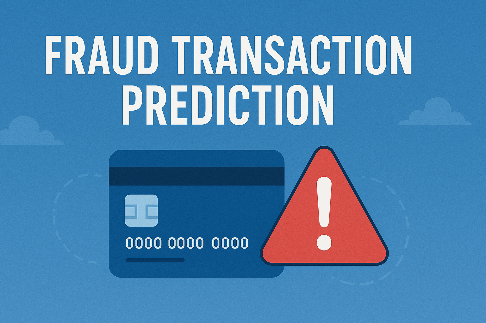
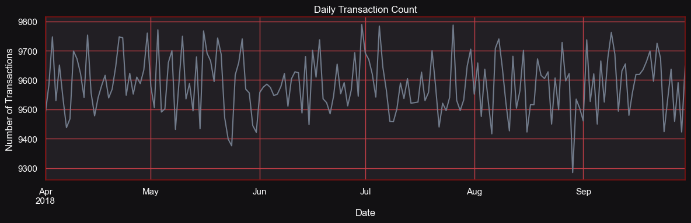
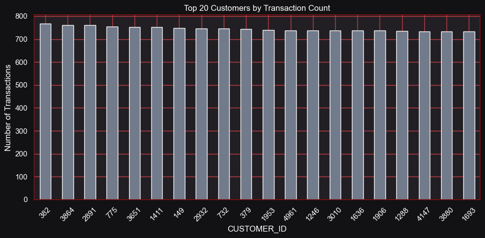
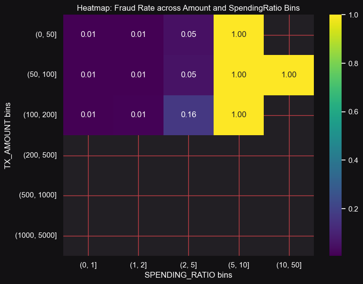
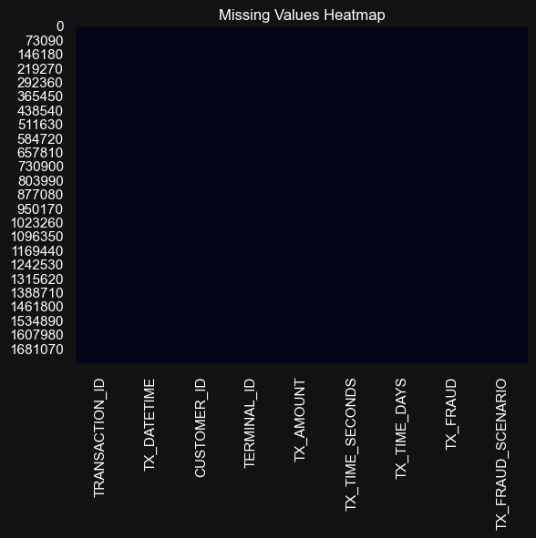

<!-- ============================= -->
<!-- 🏢 Company Header -->
<!-- ============================= -->

  
  Unified Mentor Private Limited

 

<!-- ============================= -->
<!-- 🎯 Project Banner -->
<!-- ============================= -->

  

<!-- ============================= -->
<!-- 🧠 Project Title -->
<!-- ============================= -->
<h1 align='center' style="margin-bottom: 0;">
  
</h1>

<h3 align='center' style="margin-top: 0; font-weight: normal;">
  
</h3>

 

<!-- ============================= -->
<!-- 📋 Table of Contents -->
<!-- ============================= -->
<h2 style="text-align:center;">📑 Table of Contents</h2>
<ul style="font-size:15px; line-height:1.8;">
  <li>About This Project</li>
  <li>Problem Statement</li>
  <li>What the Dataset Contains</li>
  <li>Main Libraries Used</li>
  <li>Visualizations & Charts</li>
  <li>Conclusion</li>
  <li>Acknowledgments</li>
</ul>
 

<!-- ============================= -->
<!-- 📘 About This Project -->
<!-- ============================= -->
<h2>📘 About This Project</h2>

The goal of this project is to <b>develop a system that can classify transactions as fraudulent or legitimate</b>.  
The dataset used is a simulated collection of transaction data designed to mimic real-world scenarios of online financial fraud.

The simulated frauds are based on the following conditions:

<ol style="font-size:15px; line-height:1.7;">
  <li><b>High Transaction Amounts:</b> Any transaction where <code>TX_AMOUNT &gt; 220</code> is marked as fraud.  
  This pattern helps validate basic fraud detection behavior.</li> 
  <li><b>Compromised Terminals:</b> Two terminals are randomly selected daily, and all transactions processed through them for the next 28 days are labeled as fraud — simulating terminal-based fraud scenarios.</li> 
  <li><b>Compromised Customers:</b> Three customers are randomly chosen each day; one-third of their transactions are multiplied by 5 in value and marked as fraudulent — simulating stolen-card or “card-not-present” fraud.</li>
</ol>

This project was developed as part of the <b>Machine Learning Internship</b> at <b>Unified Mentor Private Limited</b>.

 

<!-- ============================= -->
<!-- ❓ Problem Statement -->
<!-- ============================= -->
<h2>❓ Problem Statement</h2>

Financial fraud is one of the fastest-growing threats in today’s digital economy. Every second, hundreds of online transactions occur — but how can we determine which are genuine and which are fraudulent?

<ul style="font-size:15px; line-height:1.8;">
  <li>🤔 Can machines learn to identify fraudulent transactions within milliseconds?</li>
  <li>💳 Which data patterns can expose hidden fraud activities?</li>
  <li>📊 How do features like transaction amount, terminal ID, or spending behavior distinguish legitimate from fraudulent activity?</li>
  <li>🚨 Can models detect frauds that even humans might overlook?</li>
  <li>🧠 Can a system evolve over time as fraudsters change their tactics?</li>
</ul>

 

<!-- ============================= -->
<!-- 🧾 Dataset Description -->
<!-- ============================= -->

  
📊 What the Dataset Contains

   
  

    <b>1.</b> <code>TRANSACTION_ID</code> – Unique identifier for each transaction.  
    <b>2.</b> <code>TX_DATETIME</code> – Date and time of the transaction.  
    <b>3.</b> <code>CUSTOMER_ID</code> – Unique identifier for each customer.  
    <b>4.</b> <code>TERMINAL_ID</code> – Unique identifier for each merchant terminal.  
    <b>5.</b> <code>TX_AMOUNT</code> – The monetary value of the transaction.  
    <b>6.</b> <code>TX_FRAUD</code> – Binary label: <code>1</code> for fraudulent, <code>0</code> for legitimate. 
  

 

<!-- ============================= -->
<!-- 🧩 Libraries Used -->
<!-- ============================= -->

 
  
🧩 Main Libraries Used
 
    
  

  🔢 <b>NumPy</b> – For fast numerical computations and array manipulation. 
  📊 <b>Pandas</b> – For efficient data loading, cleaning, and analysis. 
  📈 <b>Matplotlib & Seaborn</b> – For creating insightful visualizations. 
  🧪 <b>SciPy</b> – For statistical testing and outlier analysis. 
  ⚙️ <b>scikit-learn</b> – For preprocessing, model training, evaluation, and resampling. 
  🚀 <b>XGBoost & LightGBM</b> – For optimized gradient boosting and ensemble learning. 
  💾 <b>pickle & joblib</b> – For model saving and reusability. 
  🧱 <b>sys, os</b> – For system-level operations. 
  ⏱️ <b>datetime & deque</b> – For handling time-based features and data structures. 
  🔄 <b>tqdm</b> – For progress tracking during model training. 
  🚫 <b>Warnings</b> – For clean and uncluttered notebook output. 
  

 

<!-- ============================= -->
<!-- 📉 Visualizations Section -->
<!-- ============================= -->

  
📉 Visualizations & Charts

   
  

    
    
    
    
    
    
  

 

<!-- ============================= -->
<!-- 🧾 Conclusion Section -->
<!-- ============================= -->

  
📘 Conclusion

   
  <!-- (Insert the previously enhanced Conclusion section here — no need to repeat) -->

 

<!-- ============================= -->
<!-- 🙏 Acknowledgment -->
<!-- ============================= -->
<h3>🙏 Acknowledgments</h3>

This project applies machine learning techniques to understand and predict fraudulent transactions.  
Sincere thanks to <b>Unified Mentor Private Limited</b> for the opportunity to work on this research-oriented project.  
Special appreciation to the open-source community for creating the tools and libraries that make such innovations possible.

Created with 🧠 by 
  <a href="https://github.com/KushangShah" target="_blank">Kushang Shah</a>

  

